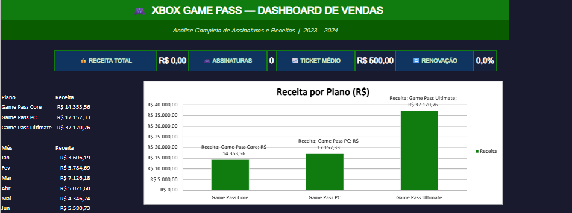
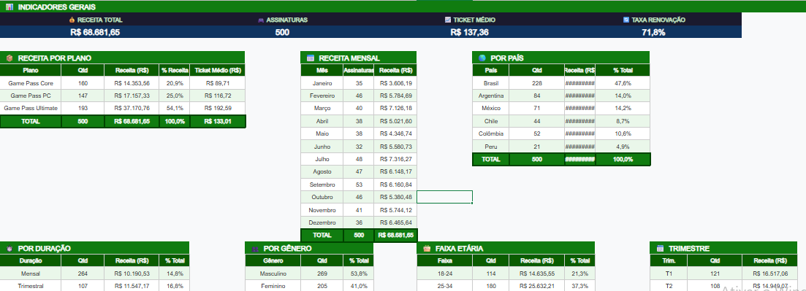
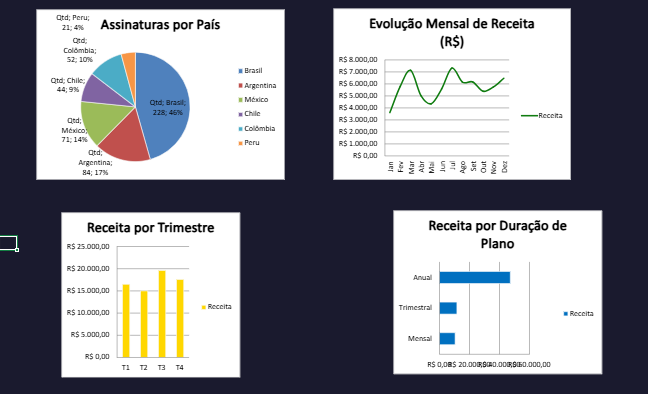

# 🎮 Dashboard de Vendas — Xbox Game Pass

> Desafio prático da [DIO (Digital Innovation One)](https://dio.me) — Criação de Dashboard de Vendas no Excel

---

## 🖼️ Preview

### Dashboard Principal


### Base de Dados


### Tabelas de Análise


---

## 📋 Sobre o Projeto

Este projeto consiste em um **dashboard de vendas interativo** desenvolvido no Microsoft Excel, com foco na organização, análise e visualização de dados de assinaturas do **Xbox Game Pass**.

O objetivo é transformar dados brutos em informações visuais claras e úteis, permitindo uma análise eficaz do desempenho de vendas e a tomada de decisões baseadas em dados.

---

## 📊 Estrutura do Arquivo Excel

O arquivo `dashboard_xbox.xlsx` contém **3 abas**:

### 1. `Base de Dados`
Tabela com **500 registros** de assinaturas fictícias contendo:

| Coluna | Descrição |
|---|---|
| ID | Identificador único da assinatura |
| Data | Data da compra (dd/mm/aaaa) |
| Mês | Nome do mês |
| Trimestre | T1, T2, T3 ou T4 |
| Ano | 2023 ou 2024 |
| Plano | Xbox Game Pass Core / PC / Ultimate |
| Duração | Mensal, Trimestral ou Anual |
| Renovação Automática | Sim / Não |
| Valor (R$) | Preço original do plano |
| Desconto (%) | Desconto aplicado (0%, 5%, 10%, 15% ou 20%) |
| Valor Final (R$) | Valor após desconto |
| País | Brasil, Argentina, México, Chile, Colômbia, Peru |
| Região | América do Sul / América do Norte |
| Gênero | Masculino, Feminino, Não Informado |
| Faixa Etária | 18-24, 25-34, 35-44, 45-54, 55+ |

### 2. `Análises`
Aba intermediária com **tabelas de apoio** calculadas por fórmulas Excel:
- Indicadores Gerais (KPIs)
- Receita por Plano
- Receita Mensal
- Receita por País
- Receita por Duração
- Distribuição por Gênero
- Distribuição por Faixa Etária
- Receita por Trimestre

### 3. `Dashboard`
Aba principal com **visualizações interativas**:

| # | Gráfico | Tipo |
|---|---|---|
| 1 | Receita por Plano | Gráfico de Colunas |
| 2 | Evolução Mensal de Receita | Gráfico de Linhas |
| 3 | Assinaturas por País | Gráfico de Pizza |
| 4 | Receita por Duração de Plano | Gráfico de Barras |
| 5 | Receita por Trimestre | Gráfico de Colunas |

**KPIs em destaque:**
- 💰 Receita Total
- 🎮 Total de Assinaturas
- 📈 Ticket Médio
- 🔄 Taxa de Renovação

---

## 💡 Dados Utilizados

Os dados são **fictícios**, gerados de forma aleatória com seed fixo (`random.seed(42)`) para garantir reprodutibilidade.

**Premissas dos dados:**
- 500 assinaturas distribuídas entre 2023 e 2024
- Plano Ultimate tem maior participação (40%) vs Core e PC (30% cada)
- Brasil representa ~45% das assinaturas
- 70% dos assinantes têm renovação automática ativa
- Duração mensal é a mais comum (50%), seguida de trimestral (25%) e anual (25%)

**Tabela de Preços Utilizados:**

| Plano | Mensal | Trimestral | Anual |
|---|---|---|---|
| Game Pass Core | R$ 29,90 | R$ 79,90 | R$ 269,90 |
| Game Pass PC | R$ 39,90 | R$ 109,90 | R$ 359,90 |
| Game Pass Ultimate | R$ 54,90 | R$ 149,90 | R$ 499,90 |

---

## 🚀 Como Reproduzir

### Pré-requisitos
- Python 3.8+
- Biblioteca `openpyxl`

### Passos

1. **Clone o repositório:**
   ```bash
   git clone https://github.com/seu-usuario/dashboard-xbox-dio.git
   cd dashboard-xbox-dio
   ```

2. **Instale as dependências:**
   ```bash
   pip install openpyxl
   ```

3. **Execute o script para gerar o arquivo Excel:**
   ```bash
   python create_dashboard.py
   ```

4. **Abra o arquivo gerado:**
   ```
   dashboard_xbox.xlsx
   ```
   > Navegue até a aba **Dashboard** para visualizar o painel completo.

---

## 🛠️ Tecnologias

- **Microsoft Excel** — Plataforma do dashboard
- **Python 3** — Geração automatizada do arquivo Excel
- **openpyxl** — Biblioteca Python para manipulação de arquivos `.xlsx`

---

## 📁 Estrutura do Repositório

```
dashboard-xbox-dio/
│
├── dashboard_xbox.xlsx     # Dashboard Excel finalizado
├── create_dashboard.py     # Script Python que gera o arquivo
└── README.md               # Este arquivo
```

---

## 👤 Autor

Desenvolvido como entrega do **Desafio de Projeto DIO** — Criando um Dashboard de Vendas no Excel.

---

## 📄 Licença

Este projeto é de uso educacional. Os dados são completamente fictícios e não representam informações reais da Microsoft ou do Xbox Game Pass.
